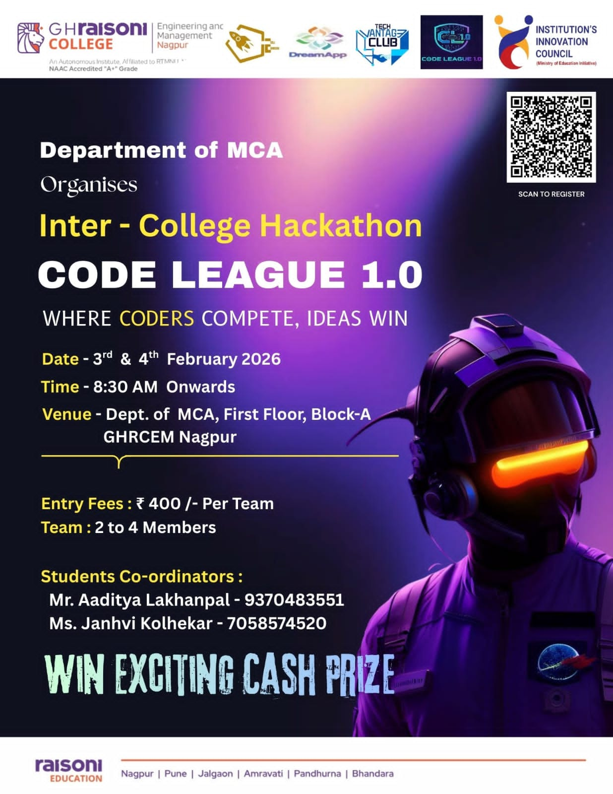

# Code League 1.0 – Hackathon Project 🚀  

This repository contains our team’s work developed during **Code League 1.0**, an inter-college hackathon organized by the **Department of MCA, GHRCE Nagpur**.

The project focuses on building a practical, efficient, and user-friendly solution using modern technologies and best development practices.

## 🧠 About the Project

- Designed and developed during a 20+ hour hackathon
- Problem statement was provided during the event
- Emphasis on innovation, scalability, and real-world usability
- Built with a clean structure and readable code

## 🛠️ Technologies Used

- Frontend: HTML, CSS, JavaScript  
- Backend: Python / Node.js / Next.js(as applicable)
- Database: MySQL / MongoDB (if used)  
- Tools: Git, GitHub, VS Code, Google Script

*(Technologies may vary based on final implementation)*

## ✨ Features

- Simple and intuitive user interface  
- Efficient data handling  
- Responsive design  
- Modular and scalable code structure  

## 📂 Project Structure

<pre>
(main)
   |---------> index.html (interface)
   |---------> css
   |            |--------> style.css
   |---------> js 
   |            |--------> main.js
   |---------> netlify/functions
                |--------> saveData.js
</pre>
